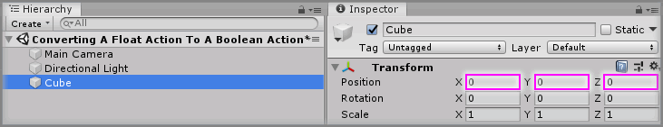
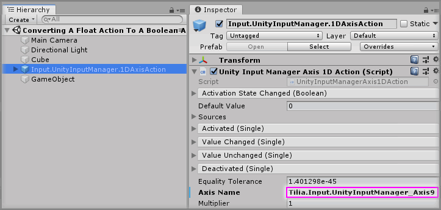
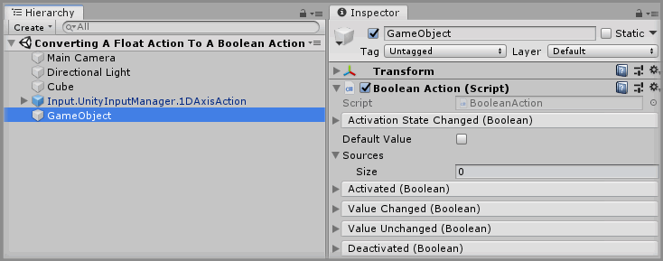
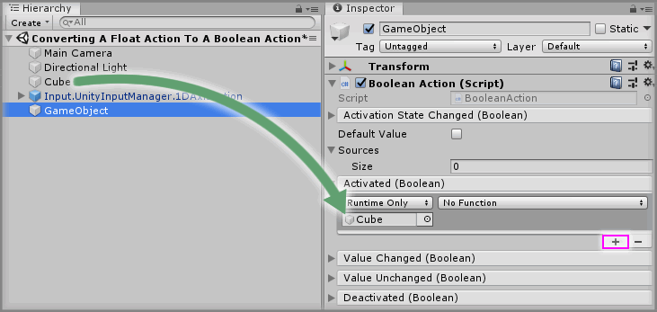
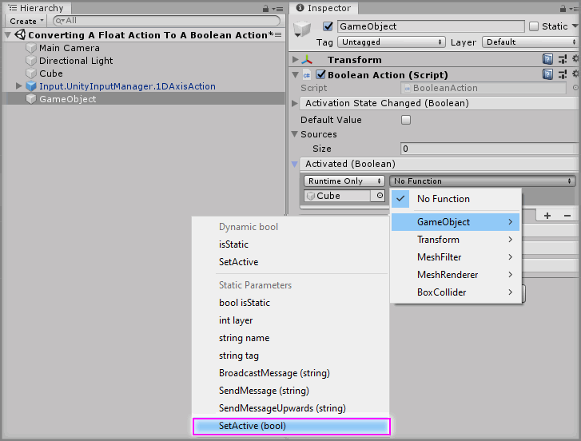
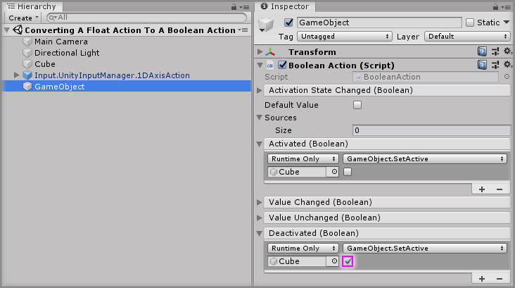
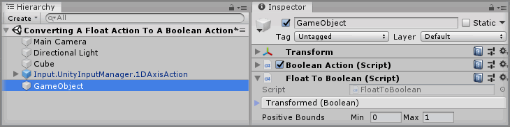
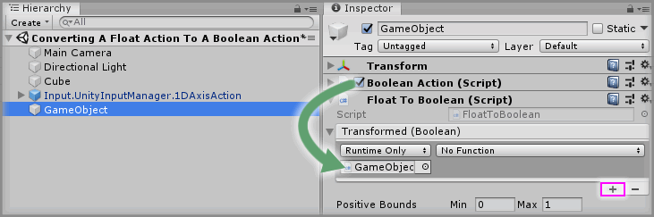
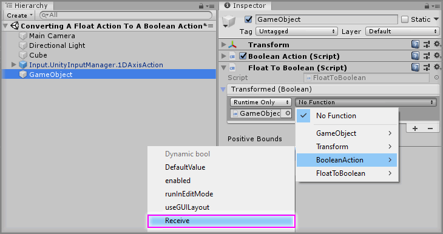
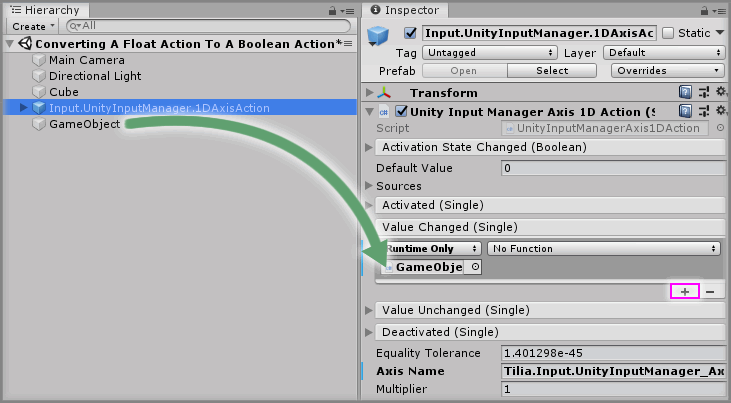

# Converting A Float Action To A Boolean Action

> * Level: Beginner
>
> * Reading Time: 5 minutes
>
> * Checked with: Unity 2018.3.14f1

## Introduction

Sometimes you may want to use the values from a `FloatAction` to activate or deactivate an action type. For example, pressing down the trigger axis on a controller causes an action to occur when the trigger is fully pressed down.

The Input Unity Input Manager Axis Actions provide a way of getting the varying value data from an axis but don’t really provide a way of letting us trigger something when that value reaches a specific value. This can be done by taking the float value and converting it into a boolean when the float value is within our specified bounds. We can then take this boolean value and pass it into a `Boolean Action` for hooking up events that are either on or off (true/false).

We can do this using the Data Type Converters provided with [Zinnia] which allow conversions from one DataType to another.

## Prerequisites

* [Install the Tilia.Input.UnityInputManager] package dependency in to your [Unity] project.

## Let's Start

### Step 1

Create a new `Cube` Unity 3D Object by selecting `Main Menu -> GameObject -> 3D Object -> Cube` and change the `Transform` properties to:

* Position: `X = 0`, `Y = 0`, `Z = 0`

### Step 2

Expand the `Tilia Input UnityInputManager` Package directory in the Unity Project window and select then `Packages -> Tilia Input UnityInputManager -> Runtime -> Prefabs -> Actions` directory then drag and drop the `Input.UnityInputManager.Axis1DAction` prefab into the Hierarchy window.

> Be sure to use the `Input.UnityInputManager.Axis1DAction` prefab and not just add the `Unity Input Manager Axis 1D Action` component to a GameObject as the component needs linking to a `MomentProcessor` to function.

### Step 3

Select the `Input.UnityInputManager.Axis1DAction` GameObject in the Hierarchy window and change the `Axis Name` parameter on the `Unity Input Manager Axis 1D Action` component to listen for the desired axis, in this case enter `Tilia.Input.UnityInputManager_Axis9` to listen for the Left Trigger axis on an Xbox Controller.

### Step 4

Create an empty `GameObject` in the Unity Hierarchy then click the `Add Component` button and select the `Boolean Action` component. This newly created `Boolean Action` will be the action that defines when our trigger axis is true or false.

### Step 5

Click the `+` symbol in the bottom right corner of the `Activated` event parameter in the `Boolean Action` component and then drag and drop the `Cube` GameObject into the box that appears and displays `None (Object)`.
 

Select a `Function` to perform when the `Activated` event is emitted. For this example, select `GameObject -> SetActive(bool)` (be sure not to select `Dynamic bool - SetActive` for this example).
 

### Step 6

Do the same as [Step 5] but for the `Deactivated` event parameter in the `Boolean Action` component, but tick the checkbox under the `GameObject.SetActive` function.

### Step 7

Click the `Add Component` button and select the `Float To Boolean` component. This newly created `Float To Boolean` will convert our float value from the trigger axis to a boolean when the value is within our defined range.

### Step 8

Click the `+` symbol in the bottom right corner of the `Transformed` event parameter in the `Float To Boolean` component and then drag and drop the `Boolean Action` component into the box that appears and displays `None (Object)`.
 

Select a `Function` to perform when the `Transformed` event is emitted. For this example, select `Boolean Action -> Receive` (be sure to select `Dynamic bool - Receive` for this example).
 

### Step 9

Select the `GameObject` GameObject from the Unity Hierarchy and on the `Float To Boolean` component change the `Positive Bounds -> Min` value to `0.5` and the `Positive Bounds -> Max` value to `1`.

### Step 10

Select the `Input.UnityInputManager.1DAxisAction` in the Unity Hierarchy and click the `+` symbol in the bottom right corner of the `Value Changed` event parameter in the `Unity Input Manager Axis 1D Action` component and then drag and drop the `GameObject` GameObject into the box that appears and displays `None (Object)`.

Select a `Function` to perform when the `Value Changed` event is emitted. For this example, select `Float To Boolean -> DoTransform` (be sure to select `Dynamic float - DoTransform` for this example).
 

### Done

Play the Unity scene and press the Left Trigger axis on the Xbox Controller and notice how the Cube will disappear when the axis passes half way. This `Boolean Action` can now be used to drive other output events too such as grabbing an item or even activating a pointer.

[Zinnia]: https://github.com/ExtendRealityLtd/Zinnia.Unity
[Install the Tilia.Input.UnityInputManager]: ../Installation/README.md
[Unity]: https://unity3d.com/
[Step 5]: #Step-5