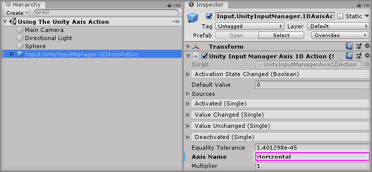
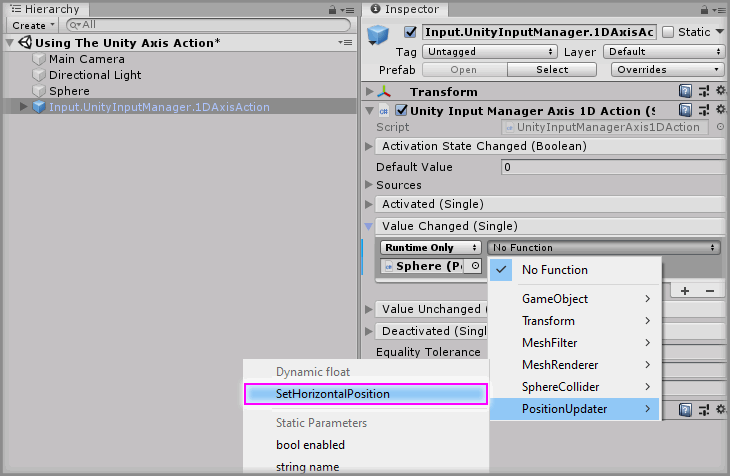

# Using The Unity Axis Action

> * Level: Beginner
>
> * Reading Time: 10 minutes
>
> * Checked with: Unity 2018.3.14f1

## Introduction

Unity Input Manager Axis Actions tie into the [Unity Input Manager] and emit events when a defined input axis changes value. There are two kinds of Unity Axis Action:

* `UnityInputManager.1DAxisAction` listens for changes on a single axis and emits a `float` value for the axis changes.
* `UnityInputManager.2DAxisAction` listens for changes on a two axes and emits a `Vector2` value combining both axis changes.

A Unity Axis Action is derived from a [Zinnia] Action and therefore can be injected into any component that accepts a Zinnia Action.

## Prerequisites

* [Install the Tilia.Input.UnityInputManager] package dependency in to your [Unity] project.
* Create the [Tilia Input Axis Definitions] in your Unity project.

### Step 1

Create a new `Sphere` Unity 3D Object by selecting `Main Menu -> GameObject -> 3D Object -> Sphere`.

We will utilize a 1D axis action to control the position of this sphere in the scene.

### Step 2

Expand the `Tilia Input UnityInputManager` Package directory in the Unity Project window and select then `Packages -> Tilia Input UnityInputManager -> Runtime -> Prefabs -> Actions` directory then drag and drop the `Input.UnityInputManager.1DAxisAction` prefab into the Hierarchy window.

> Be sure to use the `Input.UnityInputManager.1DAxisAction` prefab and not just add the `Unity Input Manager Axis 1D Action` component to a GameObject as the component needs linking to a `MomentProcessor` to function.


### Step 3

We need to define the axis to listen to on the `Unity Input Manager Axis 1D Action` component found within the `Input.UnityInputManager.1DAxisAction` prefab.

There are many different supported axes depending on the input peripheral being used and this package creates an additional 18 axis definitions named `Tilia.Input.UnityInputManager_AxisX` (where X is the number of the axis ranging from 3 to 20 e.g. `Tilia.Input.UnityInputManager_Axis3`).

The Unity software also has 2 default axis values called `Horizontal` and `Vertical` which map to the arrows on the keyboard and the standard joystick movement of an input peripheral.

Select the `Input.UnityInputManager.1DAxisAction` GameObject in the Hierarchy window and update the `Axis Name` parameter on the `Unity Input Manager Axis 1D Action` component to listen changes on the specified axis, in this case type `Horizontal` to listen for changes on the default horizontal axis definition within the Unity Input Manager definitions.



### Step 4

We'll need to create a small script that allows us to change the position of our `Sphere` GameObject to test our newly created `1D Axis Action`.

Create a new `Script` by selecting `Main Menu -> Assets -> Create -> C# Script` in the Unity software and name it `PositionUpdater`.

Copy and paste the below code into the newly created `PositionUpdater` script:

```
using UnityEngine;

public class PositionUpdater : MonoBehaviour
{
    public void SetHorizontalPosition(float newPosition)
    {
        transform.position = Vector3.right * newPosition;
    }
}
```

This simply script has a single method called `SetHorizontalPosition` which will take a `float` value that sets the position of the `Transform` that the component is on in relation to the left/right axis of the GameObject.

> The `Vector3.right * newPosition` calculation is basically creating a new Vector3 position value based on the world right direction multiplied by the new position value provided. So if `newPosition` was `0` then `Vector3.right` which is a literal of `(0, 0, 1)` would be `(0, 0, 1) * 0 = (0, 0, 0)` and this would set the GameObject position to a world space of `(0, 0, 0)`. If we passed in a `newPosition` of `1` then the GameObject position will be calculated as `(0, 0, 1)`.

Add the `PositionUpdater` scrip to the `Sphere` GameObject.

### Step 5

Now to set up the `Unity Input Manager Axis 1D Action` component to update the position of the `Sphere` GameObject when the horizontal axis changes (e.g. when we press the left/right arrow keys on the keyboard or move the left thumbstick on an Xbox controller).

Click the `+` symbol in the bottom right corner of the `Value Changed` event parameter in the `Unity Input Manager Axis 1D Action` component and then drag and drop the `Sphere` GameObject into the box that appears and displays `None (Object)`.


Select a `Function` to perform when the `Value Changed` event is emitted. For this example, select `PositionUpdater -> SetHorizontalPosition` (be sure to select `Dynamic float - SetHorizontalPosition` for this example).



### Done

Play the Unity scene and press the left/right arrow keys on the keyboard and the `Sphere` GameObject will snap to a new position according to the key being pressed. Alternatively, use an Xbox Controller and move the left thumbstick left and right to see the `Sphere` match the position of where the left thumbstick is being pushed to.

This is because when the axis is not being touched at all, the axis value will be `0`. When the axis is fully pushed to the right, the axis value will be `1`. When the axis is fully pushed to the left, the axis value will be `-1`. The value of the axis can be anything between `-1` and `1` depending on the amount of pressure applied to the input peripheral. This axis value is then being passed to control the `X` position of the GameObject in world space.

[Unity Input Manager]: https://docs.unity3d.com/Manual/class-InputManager.html
[Zinnia]: https://github.com/ExtendRealityLtd/Zinnia.Unity
[Install the Tilia.Input.UnityInputManager]: ../Installation/README.md
[Unity]: https://unity3d.com/
[Tilia Input Axis Definitions]: ../Installation/README.md#step-4-creating-the-required-unity-input-manager-axis-definitions