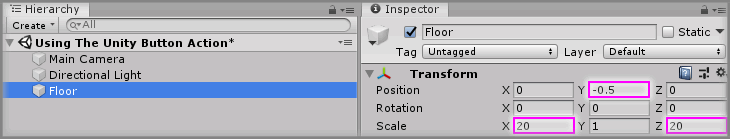
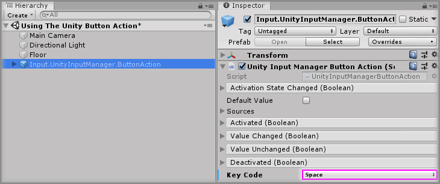
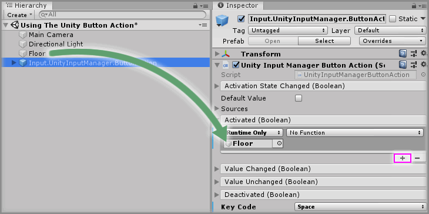
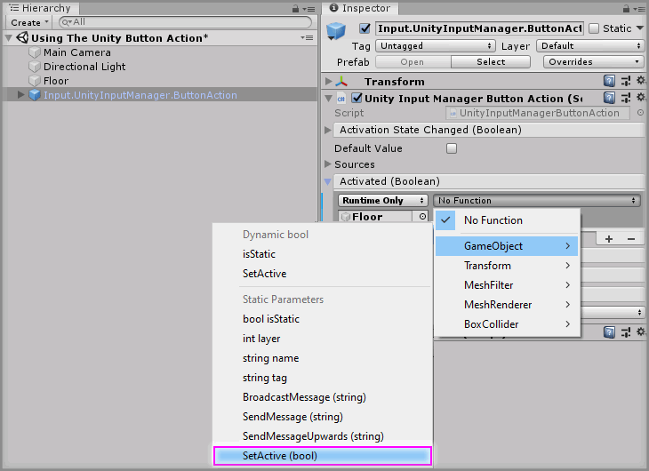
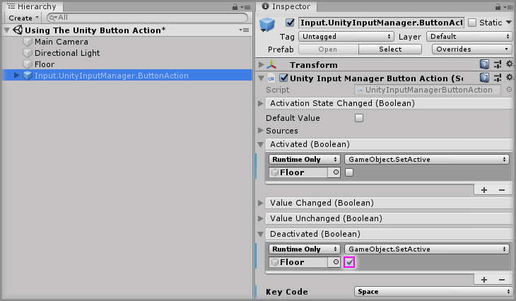
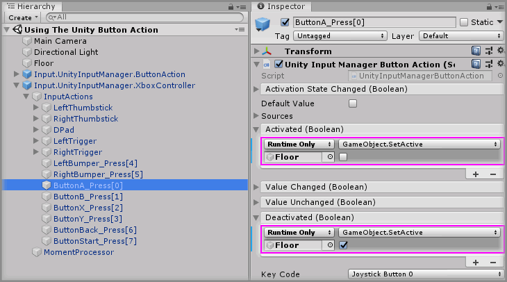

# Using The Unity Button Action

> * Level: Beginner
>
> * Reading Time: 5 minutes
>
> * Checked with: Unity 2018.3.14f1

## Introduction

Unity Button Actions utilize the [Unity Input Manager] framework and emit events when a defined Input button is pressed and released.

A Unity Button Action is derived from a [Zinnia] Action and therefore can be injected into any component that accepts a Zinnia Action.

## Prerequisites

* [Install the Tilia.Input.UnityInputManager] package dependency in to your [Unity] project.

## Let's Start

### Step 1

Create a new `Cube` Unity 3D Object by selecting `Main Menu -> GameObject -> 3D Object -> Cube` then rename the GameObject to `Floor` and change the `Transform` properties to:

* Position: `X = 0`, `Y = -0.5`, `Z = 0`
* Scale: `X = 20`, `Y = 1`, `Z = 20`

This will form the basic floor of the scene world and provide a way of testing a button action by toggling this GameObject on and off when a specified button is pressed.

### Step 2

Add a `Input.UnityInputManager.ButtonAction` prefab to the Unity project hierarchy by selecting `GameObject -> Tilia -> Prefabs -> Input -> UnityInputManager -> Actions -> Input.UnityInputManager.ButtonAction` from the Unity main top menu.

> Be sure to use the `Input.UnityInputManager.ButtonAction` prefab and not just add the `Unity Input Manager Button Action` component to a GameObject as the component needs linking to a `MomentProcessor` to function.

### Step 3

Select the `Input.UnityInputManager.ButtonAction` GameObject in the Unity Hierarchy window and change the `Key Code` parameter on the `Unity Input Manager Button Action` component to listen for the desired key press, in this case select `Space` to listen for the press of the Spacebar on the keyboard.

### Step 4

The `Unity Input Manager Button Action` component has 5 events that can be hooked into: 

* `Activation State Changed` is emitted when the activation state of the action changes from the previous state.
* `Activated` is emitted when the button is pressed down.
* `Value Changed` is emitted when the state of the button value changes, e.g. goes from being pressed down to being released.
* `Value Unchanged` is emitted when the state of the button value hasn't changed from the previous time the action was called.
* `Deactivated` emitted when the button is released and no longer pressed down.

For an example of how to hook these events into doing something, let's make the `Floor` GameObject disappear when the Spacebar is pressed and then have it reappear when the Spacebar is released.

Click the `+` symbol in the bottom right corner of the `Activated` event parameter in the `Unity Button Action` component and then drag and drop the `Floor` GameObject into the box that appears and displays `None (Object)`.

Select a `Function` to perform when the `Activated` event is emitted. For this example, select `GameObject -> SetActive(bool)` (be sure not to select `Dynamic bool - SetActive` for this example).

### Step 5

Do the same as [Step 4] but for the `Deactivated` event parameter in the `Unity Input Manager Button Action` component, but tick the checkbox under the `GameObject.SetActive` function.

Play the Unity scene and press the Spacebar on the keyboard and the `Floor` GameObject will disappear when the key is pressed down and reappear when the key is released.

### Step 6

Let's use one the `Controller Mapping` prefabs to do the same action as outlined above but based on a controller press.

Add a `Input.UnityInputManager.XboxController` prefab to the Unity project hierarchy by selecting `GameObject -> Tilia -> Prefabs -> Input -> UnityInputManager -> ControllerMappings -> Input.UnityInputManager.XboxController` from the Unity main top menu.

### Step 7

Select the appropriate controller Input Mapping GameObject in the Unity Hierarchy window and expand the sub elements to expose the available input mapping actions.

Select the `Input.UnityInputManager.XboxController -> InputActions -> ButtonA_Press[0]` GameObject which will display the `Unity Input Manager Button Action` component that relates to the Xbox controller button A press action.

> The `Key Code` parameter on the `Unity Input Manager Button Action` component is set to `Joystick Button 0` which is the Unity Input Manager mapping for the Xbox controller A Button.

Follow [Step 4] and [Step 5] but applied on the `Unity Input Manager Button Action` component related to the `ButtonA_Press[0]` GameObject to add the relevant actions to happen on the `Activated` event and `Deactivated` event for when an Xbox Controller Button A is pressed down and released.

Play the Unity scene and press Button A on an Xbox Controller and the `Floor` GameObject will disappear when the key is pressed down and reappear when the key is released.

### Done

Now you have a predefined Xbox Controller button action performing the action of hiding and showing another scene GameObject when it is pressed and released. Also, a second action tied to the Spacebar on the keyboard that performs the same action of hiding and showing another scene GameObject.

Duplicating Action outcomes is not ideal as if you require many different inputs to perform the same output, then you don't want to have to wire up the same action outcomes in all of the Actions you add to your scene. This can be streamlined by creating Proxy Actions and chaining actions together.

[Unity Input Manager]: https://docs.unity3d.com/Manual/class-InputManager.html
[Zinnia]: https://github.com/ExtendRealityLtd/Zinnia.Unity
[Install the Tilia.Input.UnityInputManager]: ../Installation/README.md
[Unity]: https://unity3d.com/
[Step 4]: #step-4
[Step 5]: #step-5